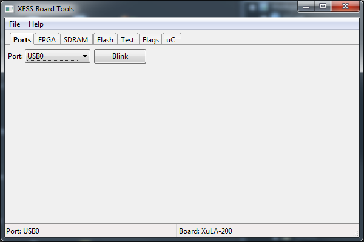
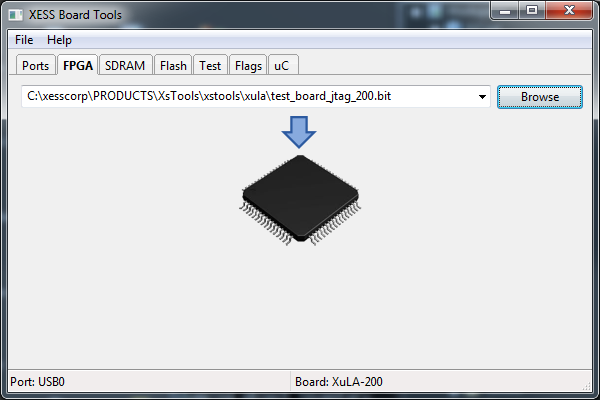
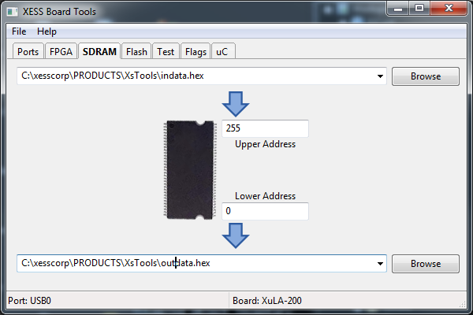
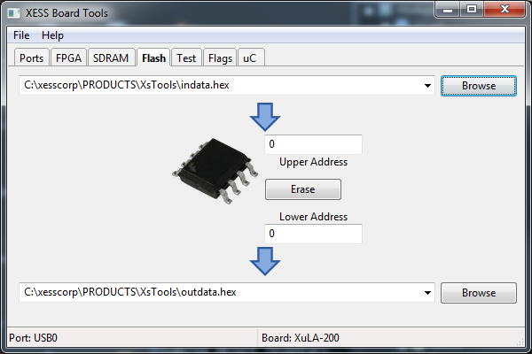
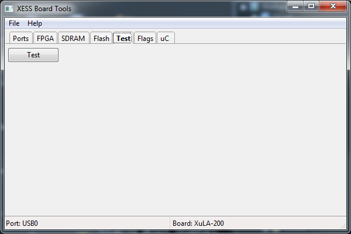
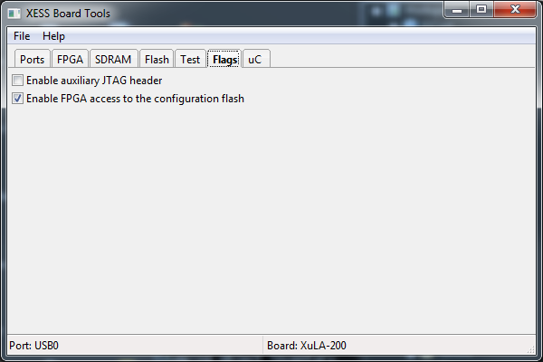
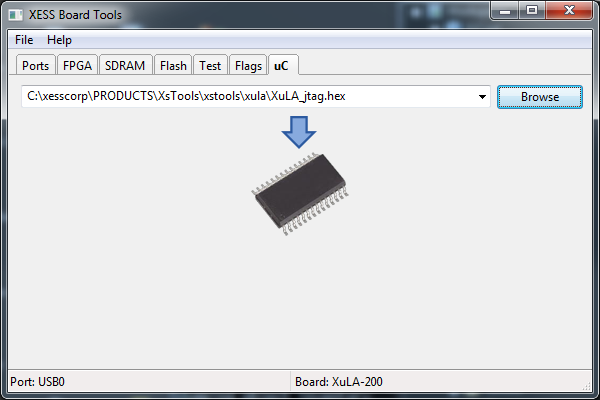

Usage
########

The Python XSTOOLs utilities are used to:

* Test XESS XuLA FPGA boards.
* Download configuration bitstream files to their FPGAs.
* Upload and download the onboard SDRAM. 
* Program and read the serial flash.
* Program and verify the code in the USB interface microcontroller.
* Set flags that control behavior.

Command-Line Tools
*******************

xstest
==========

    usage: xstest.py [-h] [-u N] [-b BOARD_NAME] [-m] [-v]

    Run self-test on an XESS board.

    optional arguments:
      -h, --help            show this help message and exit
      -u N, --usb N         The USB port number for the XESS board. If you only
                            have one board, then use 0.
      -b BOARD_NAME, --board BOARD_NAME
                            ***DEPRECATED*** The XESS board type (e.g., xula-200)
      -m, --multiple        Run the self-test each time a board is detected on the
                            USB port.
      -v, --version         Print the version number of this program and exit.
      
Examples
------------

To test a single board attached to a USB port:

    xstest
    
To test two boards attached to USB ports:

    xstest -u 0
    xstest -u 1
    
To test a whole bunch of boards, one at a time:

    xstest -m
    
(After a board is tested, remove it and attach another and the test will be run again.)

xsload
============

    usage: xsload.py [-h] [--fpga FILE.BIT] [--flash FILE.HEX] [--ram FILE.HEX]
                     [-u LOWER UPPER] [--usb N] [-b BOARD_NAME] [-v]

    Program a bitstream file into the FPGA on an XESS board.

    optional arguments:
      -h, --help            show this help message and exit
      --fpga FILE.BIT       The name of the bitstream file to load into the FPGA.
      --flash FILE.HEX      The name of the file to down/upload to/from the serial
                            configuration flash.
      --ram FILE.HEX        The name of the file to down/upload to/from the RAM.
      -u LOWER UPPER, --upload LOWER UPPER
                            Upload from RAM or flash the data between the lower
                            and upper addresses.
      --usb N               The USB port number for the XESS board. If you only
                            have one board, then use 0.
      -b BOARD_NAME, --board BOARD_NAME
                            ***DEPRECATED*** The XESS board type (e.g., xula-200)
      -v, --version         Print the version number of this program and exit.      
      
Examples
--------------

To configure the FPGA with a bitstream from a file:

    xsload --fpga my_bitstream.bit

To download a file of data in Intel HEX format to the SDRAM:

    xsload --ram my_down_data.hex
    
To upload 512 bytes of data between addresses 256 and 767 (inclusive) of the SDRAM to an Intel HEX file:

    xsload --ram my_up_data.hex --upload 256 767
    
To download an Intel HEX file to the serial flash:

    xsload --flash my_down_data.hex
    
To upload the first 1024 bytes of data from the serial flash to an Intel HEX file:

    xsload --flash --upload 0 1023

xsflags
=========

    usage: xsflags.py [-h] [-u N] [-b BOARD_NAME] [-j {on,off}] [-f {on,off}]
                      [-r READ] [-v]

    Change configuration flags on an XESS board.

    optional arguments:
      -h, --help            show this help message and exit
      -u N, --usb N         The USB port number for the XESS board. If you only
                            have one board, then use 0.
      -b BOARD_NAME, --board BOARD_NAME
                            ***DEPRECATED*** The XESS board type (e.g., xula2-lx9)
      -j {on,off}, --jtag {on,off}
                            Turn the auxiliary JTAG port on or off.
      -f {on,off}, --flash {on,off}
                            Make the serial flash accessible to the FPGA. (Only
                            applies to the XuLA-50 & XuLA-200 boards.)
      -r, --read            Read the flag settings from the XESS board.
      -v, --version         Print the version number of this program and exit.
      
Examples
------------

To enable the auxiliary JTAG port of a XuLA or XuLA2 board:

    xsflags --jtag on
    
After this, the other XSTOOLs utilities will no longer work because the USB port will no longer
have access to the JTAG port of the FPGA.
In order to re-enable USB access to the JTAG port, use the command:

    xsflags --jtag off
    
The serial flash on the XuLA boards (but **not** the XuLA2 boards) is normally not accessible by the FPGA.
This can be changed with the command:

    xsflags --flash on
    
Once the flash is enabled, the FPGA can no longer reliably use the SDRAM.
To disable the flash (and re-enable the SDRAM), use the command:

    xsflags --flash off
    
The setting of the flash flag has no effect on the XuLA2 boards because the serial flash
is always accessible to the FPGA.
    
To read the current settings of the flags from the board:

    xsflags --read

      
xsusbprg
============

    usage: xsusbprg.py [-h] [-f FILE.HEX] [-u N] [-b BOARD_NAME] [-m] [--verify]
                       [-v]

    Program a firmware hex file into the microcontroller on an XESS board.

    optional arguments:
      -h, --help            show this help message and exit
      -f FILE.HEX, --filename FILE.HEX
                            The name of the firmware hex file.
      -u N, --usb N         The USB port number for the XESS board. If you only
                            have one board, then use 0.
      -b BOARD_NAME, --board BOARD_NAME
                            The XESS board type (e.g., xula-200)
      -m, --multiple        Program multiple boards each time a board is detected
                            on the USB port.
      --verify              Verify the microcontroller flash against the firmware
                            hex file.
      -v, --version         Print the version number of this program and exit.
      
Examples
------------

To load the microcontroller with the latest firmware:

    xsusbprg
    
To load the microcontroller with the contents of an Intel HEX file:

    xsusbprg -f my_uc_program.hex
    
To verify the stored microcontroller program against a version stored in an Intel HEX file:

    xsusbprg -f my_uc_program.hex --verify
  
GUI Tool
**************

`gxstools` provides the same functions as the command-line tools, but with a GUI wrapper.
The `Ports` tab allows you to select the USB port you will be working with.
The port and the type of board attached to it are shown in the status bar at the bottom of the tab.
Pressing the `Blink` button will cause the LED to blink on the board attached to the selected USB port.

The `FPGA` tab is used to download configuration bitstream files into the FPGA.
You can select a bitstream file by:

* Typing the filename directly into the text field.
* Using the `Browse` button to go to a directory and select a bitstream file.
* Using drag-and-drop to drop a file into the text field.

Once a file is entered in the text field, clicking on the downward-pointing arrow will load the
bitstream in the file into the FPGA.

The text field maintains a history of all the files that have been downloaded to the FPGA.
This makes it easy to go back and reload the FPGA with a bitstream.

The `SDRAM` tab lets you download and upload data to/from the SDRAM.
The data in an Intel HEX file can be downloaded into the SDRAM by entering the file name into the upper text field
and then clicking on the upper downward-pointing arrow.
Similarly, data between the values typed into the `Upper Address` and `Lower Address` fields will be loaded
into the file whose name is entered into the lower text field once the lower downward-pointing arrow is clicked.

The serial flash can be handled in the same manner as the SDRAM by using the `Flash` tab.
The only additional feature is that the flash can be loaded with an FPGA configuration bitstream
by entering a `.bit` file into the upper text field.

The `Test` tab is used to run a diagnostic on the board just by clicking the `Test` button

The `Flags` tab lets you set the various flags for the board.
The current settings for the flags are indicated by the state of the checkboxes.

The microcontroller can be reprogrammed by entering the name of an Intel HEX file into the text field
of the `uC` tab and clicking on the downward-pointing arrow.

